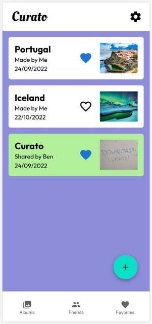
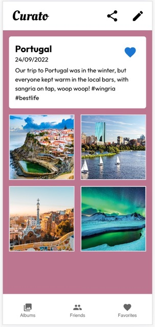
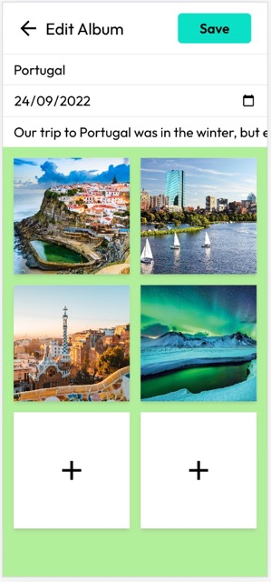
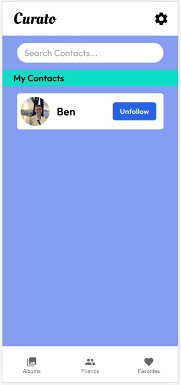

# Curato
Curato lets you curate your own media albums and share with friends.

No more endless scrolling on Instagram or getting swamped with advertising on Facebook - Just upload your photos, add your description, and share with anyone on your contacts list.

  
   
  
   

## Tech stack

Curato is a React application built in Typescript using Tailwind css for front-end design. The back-end is a Koa server connected to MongoDB for data storage. Media files are uploaded to Cloudinary for remote access.

## Getting started
After cloning Curato to a local repo, the following environment settings are required:

### **/client**
REACT_APP_CLOUD_NAME: The Cloudinary database name for remote upload of media files.

REACT_APP_UPLOAD_PRESET: A string provided by Cloudinary representing the upload config options and authorization for the account.

REACT_APP_USER: The ID of the current app user as stored in MongoDB.

### **/server**

HOSTNAME, PATH: the chosen hostname and path to connect to the server. Default values for local use are provided in the env.template.txt file.

DBPATH: the local or remote path to the MongoDB database. A default value of <mongodb://localhost:27017/curato> is recommended for local deployment.